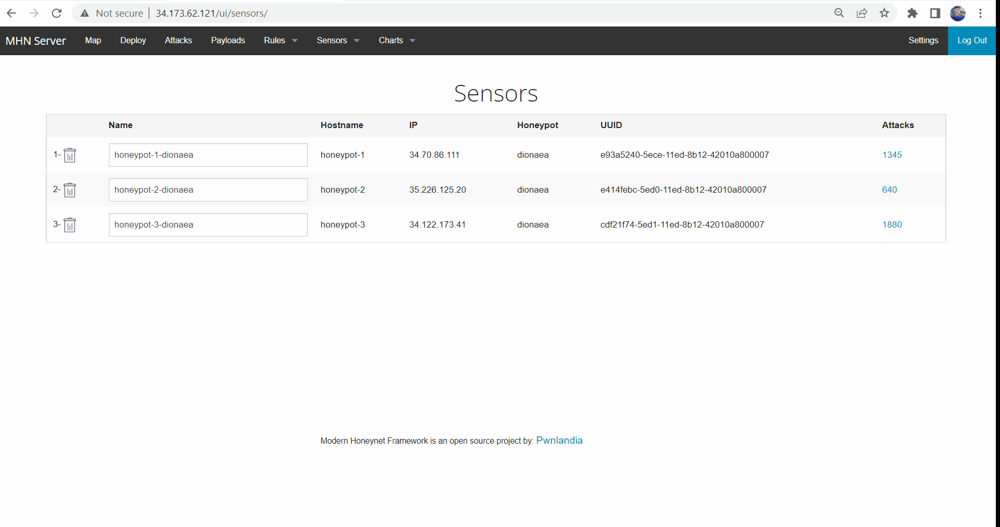
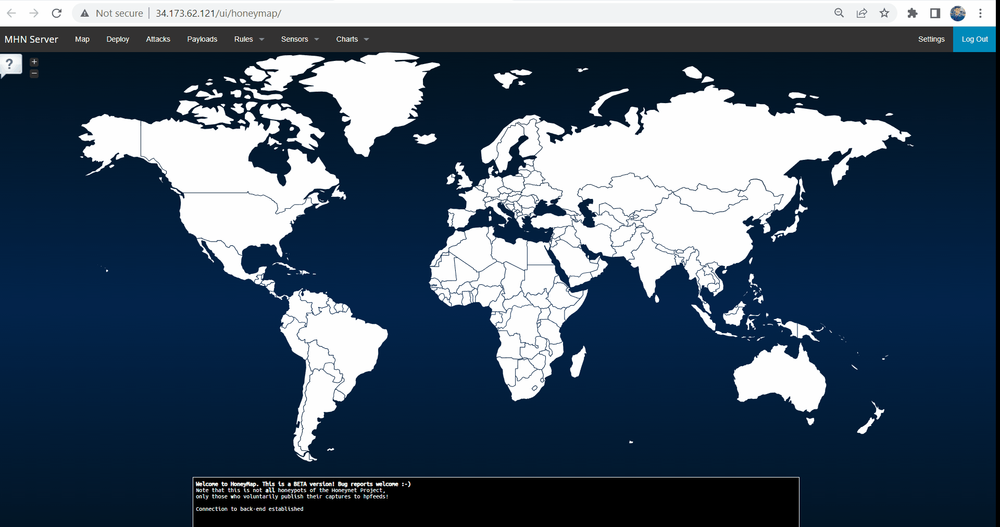
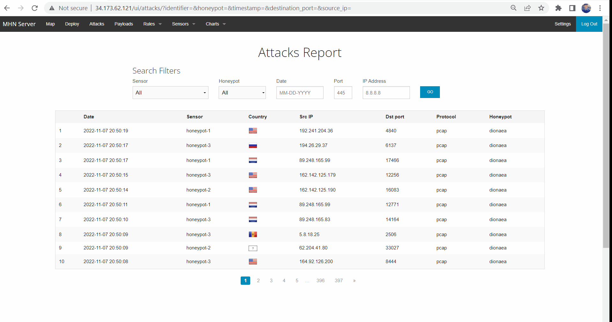

# Project_Unit_9

## MHN Honeypot
I started by downloading and initializing the Google SDK, enabling billing and compute API. I set the region and timezone, then moved on to the firewall. I created 3 firewall rules 'Http, Honeymap, & Hpfeeds' which enabled the required inbound ports for MHN Admin. I created one firewall rule 'wideopen' for the honeypots. Next I created the mhn-admin using the 'gcloud compute instances create' command. 

### MHN Admin Deployment
After creating the mhn-admin VM, I used 'gcloud compute ssh mhn-admin' command to ssh into mhn-admin. Once I established SSH access, I retrieved the latest packages and installed dependencies for MHN Admin Application. Next I downloaded the python package requirements file and patched it. Then I ran install.sh script. I added my superuser email and password during the installation. Then I loaded the external IP in my browser and logged in to the admin console via the superuser values I chose before. 

### Dioanaea Honeypot Deployment
First I createed a VM for my first honeypot via Google Cloud SDK. I used the firewall rule 'wideopen' for the honeypot. I named it honeypot-1. The firewall rule 'wideopen' allowed incoming TCP and UDP traffic on all ports for honeypot sensors. I established SSH access to the VM using 'gcloud compute ssh honeypot-1'. After establishing SSH access the new honeypot VM, I installed the honeypot application into the VM and wired it to connect back to the admin server using the 'wget' command. I copied the wget command from the Deploy nav bar option. I chose 'Ubuntu/Raspberry Pi - Dionaea' script for deployment on honeypot-1. I could now see my new sensor in  the sensor list in my browser MHN dashboard.

### (Optional) Additional Honeypot(s) Deployed
Similar to honeypot-1, I created 2 additional honeypots and named them 'honeypot-2' and 'honeypot-3' respectively. On these additional honeypots, I deployed the same wget command copied from the deploy script option in MHN dashboard in my browser. I did not encounter any major issues during the creation and deployment of all 3 honeypots. I started noticing attacks on all 3 honeypots as soon as they were deployed. I let them run for a while, and then moved on to exporting the data into a json file.

### Database Backup (session.json)
In order to export the data, I ssh-ed into the MHN admin VM and ran the command 'mongoexport --db mnemosyne --collection session > session.json'. A new file named 'session.json' was then created in my current working directory. To ensure that GitHub could handle the file, I used the truncate command 'truncate --size="<5M" session.json'. Finally, I used the 'scp' command in Google Cloud SDK to copy session.json file onto my local machine. I uploaded the session.json to this repository.

### GIF Walkthrough

### Cleanup 
I plan to delete the VMs on November 9th, 2022.
